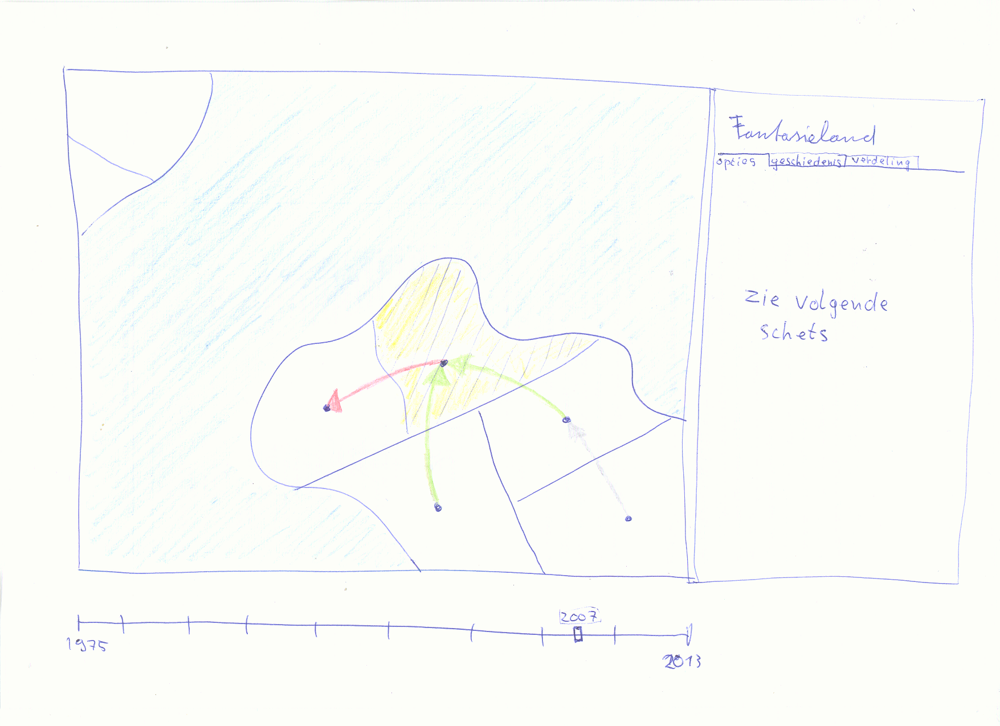
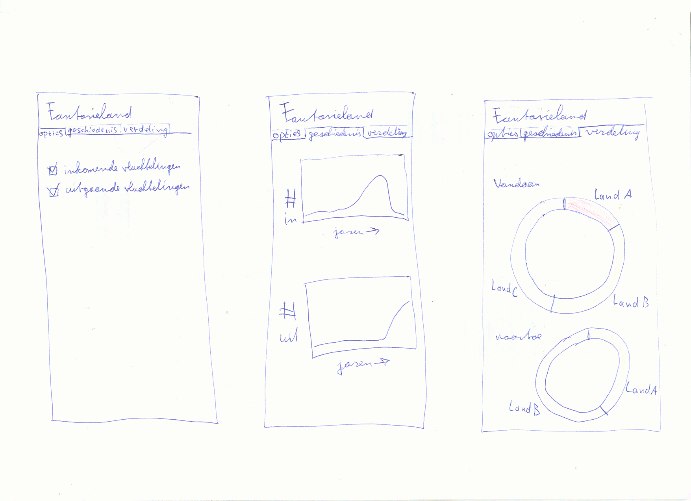

# Design document

### Elements of the Visualisation

-> HTML

* CSS Stylesheet
* Map from datamaps (javascript)
* Script with main functions (d3; javascript)
	* Map configuration
	* Draws the arrows (dependent on year)
		* data (csv)
	* Shows extra info if clicked on country and draws additional graphs
		* data (csv)

### Sketches

By clicking on country: information is presented in tab on the right. Also the arrows to and from the country are highlighted.
The exaxt location of arrows to begin/end will be calculated before and stored in a separate file.

Info displayed in different tabs

### Used APIs and Plugins
* D3.js
	* TopoJSON.js
* Datamaps.js

### Data Sources
* [UN data](http://data.un.org/Data.aspx?q=refugee&d=UNHCR&f=indID%3aType-Ref) | where from + to | 1975 - 2013
* more recent data would be nice

### Databases/Tables
* Table with UN refugee data (csv)
	Country of origin + destination; amount of refugees; year
