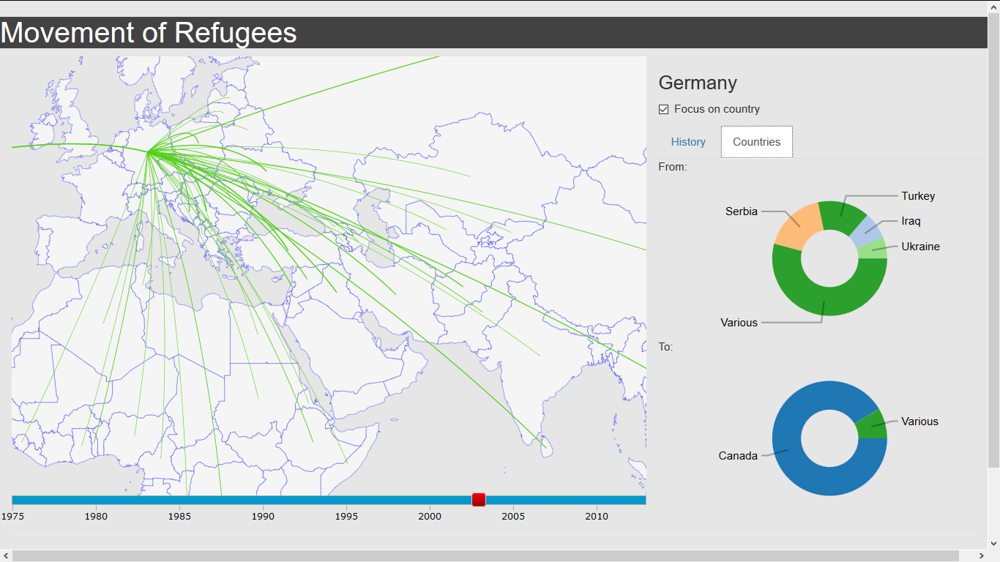

# Movement of Refugees
*by Patrick Schilder*

This is a visualisation where you can see an overview of where refugees are coming from and where they are going to. It covers the whole world and is zoomable. Every movement greater than 20 000 refugees is drawn on the map. You can move the slider below the map, to view the situation in different years.
To view more information about a country, click on it. Information will appear on the right side of the page and lines on the map that affect the clicked country (if any) will be coloured. (See picture below)

Selected country

 To filter out the lines from other countries, click on "Focus on country" just below the country name in the upper corner. Additionally, all movements of refugees greater than 1000 will be shown now. You can see this on the screenshot below.

Focus on selected country.

#### External Sources

A couple of external sources were used:

* [D3.js](https://d3js.org/) library
* [Bootstrap](http://getbootstrap.com/) library
* [UN DATA](http://data.un.org/Data.aspx?q=refugee&d=UNHCR&f=indID%3aType-Ref) for data about refugees 

Specific licenses apply to these sources.
Additionaly some example code (not licensed) is used from internet forums.

#### License
The rest of this project if covered by [The Unlicense](http://unlicense.org/).