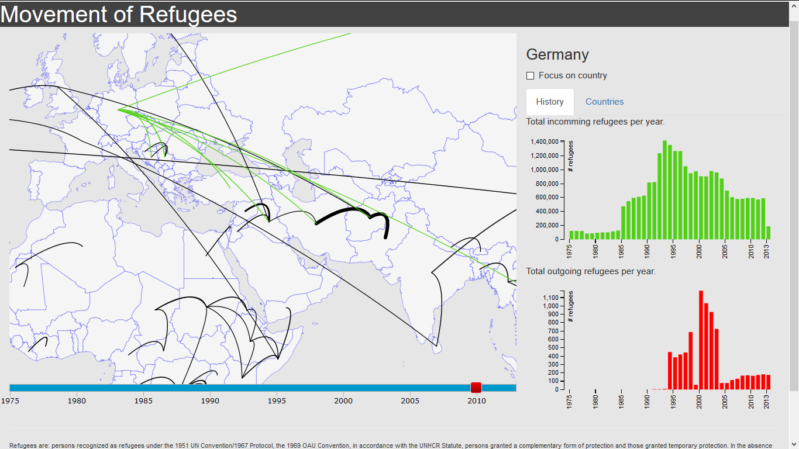

# Report
*By Patrick Schilder - 10353488*

++Table of contents++

[TOC]

### Introduction

This project shows an overview of the movement of refugees on the whole planet, during different years. Statistics about individual countries are showed on the right side of the page. A screenshot is shown below in Figure 1.
    

**Figure 1.** Screenshot with Germany selected to view more information.
    
### Visual Design

In this visualisation, the map is central. I chose to keep the map visible at all time. That means the whole project is not divided on multiple pages, but consists only of one page.
The map shows the whole world and is zoomable, so regions can be viewed in more detail. Between the countries where big amounts of refugees are moving, arcs are shown on the map. To be more presice, a movement of refugees is visible if the amount of refugees is greater then 20 000 people. I chose this number to keep the map readable, as most entries in te used data consist of rather small movements of refugees that are not particulary interesting to see, but would cover the whole map with arcs if they would be drawn.
If the user is interested to see incoming and outgoing refugees of a particular country in more detail, it is possible to check "Focus on country". This makes all the irrelevant arcs disappear and shows only the arcs connected to the selected country. Because there is more space on the map now, all the movements are shown from 1000 refugees and greater. Incoming arcs have a green colour and outgoing refugees have a red colour.

To fit the other visualisations I used tabs on the right side of the map. The other visualisations are: barcharts with the total amount of refugees per year either entering or leaving the country which is selected.

### Technical Design
    Clearly describe the technical design: how is the functionality implemented in your code? This should be like your DESIGN.md but updated to reflect the final application. First, give a high level overview, which helps us navigate and understand the total of your code (which components are there?). Second, go into detail, and describe the modules/classes and how they relate.
    
### Challenges

    Clearly describe challenges that your have met during development. Document all important changes that your have made with regard to your design document (from the PROCESS.md). Here, we can see how much you have learned in the past month.
    
### Important Decisions

    Defend your decisions by writing an argument of a most a single paragraph. Why was it good to do it different than you thought before? Are there trade-offs for your current solution? In an ideal world, given much more time, would you choose another solution?

    Make sure the document is complete and reflects the final state of the application. The document will be an important part of your grade.
